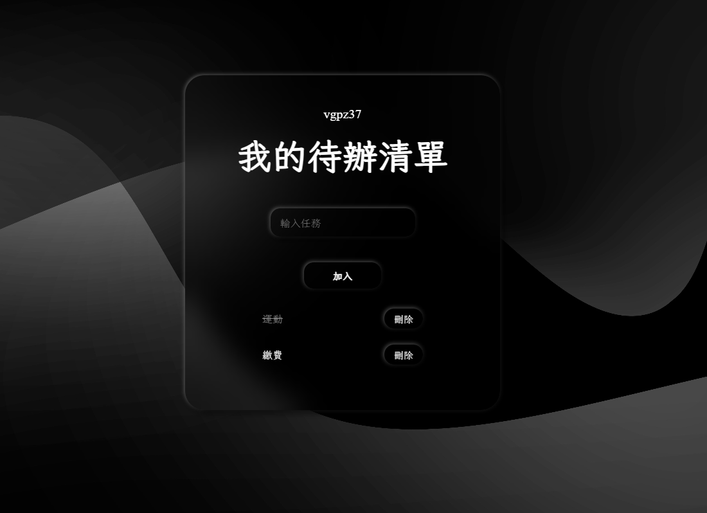

# **待辦清單 To-Do List Web App (Flask+MySQL)**

這是一個 To-Do List 專案練習的完整版本，包含前端和後端整合。

前端使用純 HTML、CSS 和 JavaScript，後端使用 Python（Flask）與 MySQL 資料庫。

可處理使用者輸入、與資料庫互動、提供 RESTful API，並儲存資料。

<br>

## 技術

- **HTML**：構建網頁基本結構

- **CSS**：設計網頁樣式與版面配置

- **JavaScript**：前端互動功能，如新增、刪除任務、切換完成狀態，並與後端同步

- **Python（Flask）**：建立 API 與伺服器，處理資料請求與傳輸

- **MySQL**：儲存使用者任務資料，支援不同裝置存取。

- **python-dotenv**：安全管理資料庫帳密資訊（透過 .env 檔案）
  
- **Render**：使用 Render 雲端部屬

- **Railway**：提供雲端 MySQL 資料庫服務

<br>

## 功能介紹

- **稱號登入**：
  - 使用者可自行輸入一組稱號（如 abc123）登入，系統即以此代號存取任務資料。
  - 稱號可跨裝置使用，輸入相同稱號可看到相同任務。
  - 若未輸入稱號，系統會自動產生一組隨機稱號。

- **新增任務**：輸入任務內容後點擊新增，即可加入清單。
- **刪除任務**：右鍵點擊任務可刪除該項目。
- **完成任務**：點擊任務可切換其完成狀態（劃掉/取消劃掉）。
- **資料儲存**：任務資料會儲存在 MySQL 資料庫中，不會因關閉伺服器而消失。
- **顯示稱號**：主畫面會顯示目前使用者的稱號，方便辨識與分享。

<br>


## 畫面預覽

### 登入畫面


### 主畫面


### 新增、刪除、切換完成及ID顯示畫面



<br>

##  專案收穫

這個專案是我練習「前後端分離 + 資料庫整合」的一個小作品：

1. 實作了 RESTful API 讓前端可動態操作任務資料

2. 使用 JavaScript fetch() 方法與後端溝通，學會非同步資料處理

3. 結合 MySQL 儲存使用者任務，學習基本的 SQL 操作與資料設計

4. 練習使用 Flask 作為 Web 應用程式框架，理解路由與 HTTP 方法

5. 加上登入稱號功能，讓使用者可以跨裝置管理同一組任務資料
  
6. 透過 .env 管理敏感資料，模擬實務部署安全性

7. 本作品已成功部署至 Render，可直接線上體驗使用 ( [ToDo-List](https://to-do-list-web-flask-mysql.onrender.com) )
> ⚠️ 本專案使用 Render 免費主機與 Railway 雲端 MySQL，首次載入與資料操作會有延遲屬正常現象。（刪除、新增、切換完成)

<br>

## 運行專案

### 1. 安裝檔案

```bash
git clone https://github.com/harvey0521/To-Do-List-Web-Flask-MySQL.git
```

### 2. 建立 & 啟用虛擬環境

```bash
cd todo-list
python -m venv venv
.\venv\Scripts\activate
```

### 3. 安裝相依套件

```bash
pip install -r requirements.txt
```

### 4. 設定 MySQL

```sql
CREATE DATABASE todo_app;
```

### 5. 建立 .env 檔案（放在專案根目錄）

```ini
DB_HOST=localhost
DB_USER=你的使用者名稱
DB_PASSWORD=你的密碼
DB_NAME=todo_app
```

### 5. 啟動 Flask 伺服器

```bash
python app.py
```
